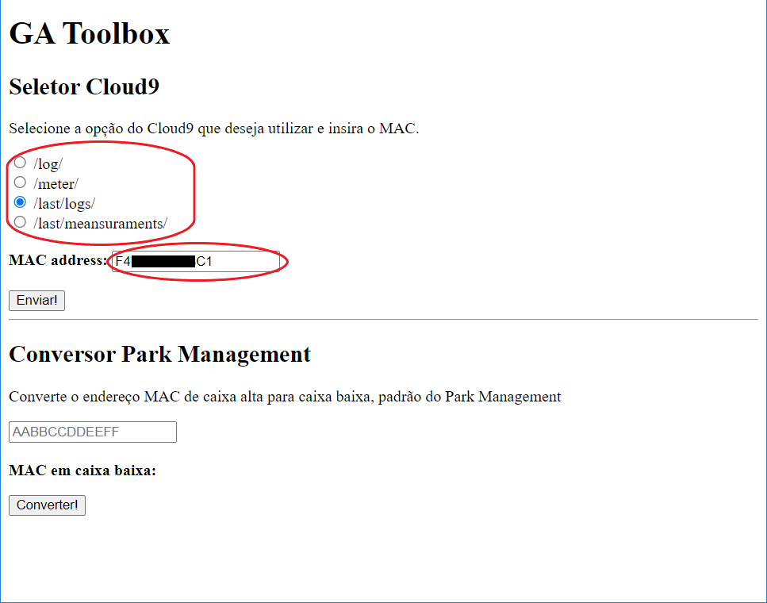
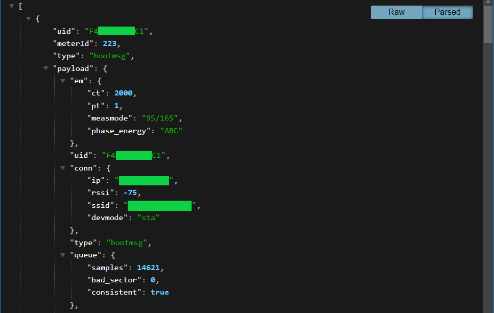

# **GA Toolbox v0.31**

## **OBJETIVO**

Está pequena página HTML tem a finalidade de facilitar o dia-a-dia dos estagiários da GreenAnt, no momento temos duas ferramentas incluídas aqui:

- Seleção das URLs de logs dos dispositivos da GreenAnt nos servidores do Classic Receiver (antigo Cloud9), providenciando uma pequena interface web onde é escolhido o tipo de log e é fornecido um MAC, ou uma lista de MACs separados por vírgula, retornando em uma nova janela a página de logs selecionada do(s) respectivo(s) MAC.
- Conversor de caixa alta para caixa baixa dos MACs, útil para inserção de dados na ferramente do Park Management que aceita apenas valores de MAC em caixa baixa.

---

## **INSTRUÇÕES**

### **SELETOR DO CLASSIC RECEIVER**

Nesta funcionalidade deve-se selecionar o campo adequado do Classic Receiver dentre as opções disponíveis, após é preciso inserir o endereço MAC ou uma lista de MACs separados por vírgula no campo `MAC address`, e por fim clicar em `Enviar!`. 

Em seguida é exibida uma página do Classic Receiver contendo as informações escolhidas a respeito do(s) dispositivo(s) selecionado(s).

Caso algum dos campos não seja selecionado ou o(s) endereço(s) MAC(s) não seja(m) inserido(s) corretamente, uma págima de erro será exibida.

As imagens abaixo exemplificam o uso da ferramenta.

### **CONVERSOR DE CAIXA ALTA**

Para utilizar esta funcionalidade basta inserir o MAC que deseja converter no campo `MAC address` e clique em `Converter!`. O MAC convertido para caixa baixa irá ser exposto ao lado do campo `MAC em caixa baixa` logo abaixo. As imagens a seguir exemplificam esta ação.

