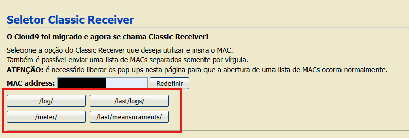
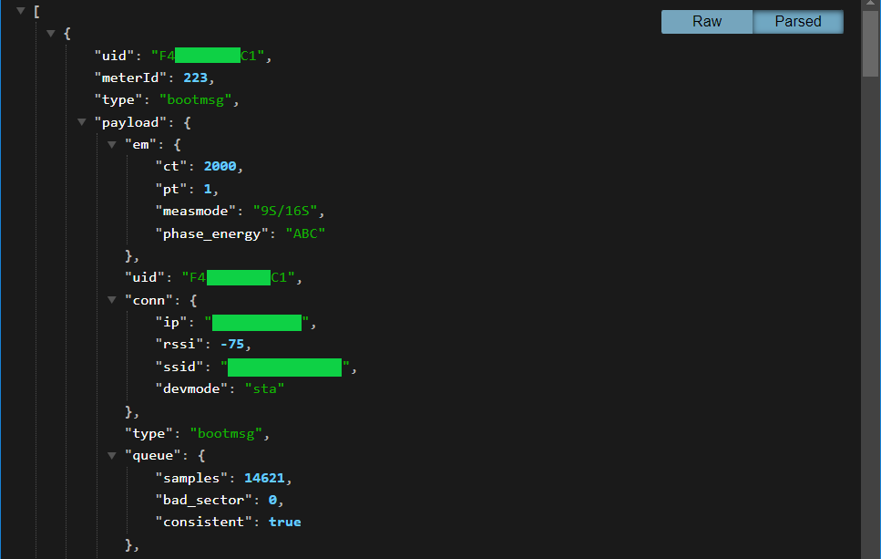

# **GA Toolbox v0.4**

## **OBJETIVO**

Está pequena página HTML tem a finalidade de facilitar o dia-a-dia dos funcionário da GreenAnt e Tyr Energia, no momento temos duas ferramentas incluídas aqui:

- Seleção das URLs de logs dos dispositivos da GreenAnt nos servidores do Classic Receiver (antigo Cloud9), fornecendo uma pequena interface web onde é escolhido o tipo de log e é fornecido um MAC, ou uma lista de MACs separados por vírgula, retornando em uma nova janela a página de logs selecionada do(s) respectivo(s) MAC.
- Conversor de caixa alta para caixa baixa dos MACs, útil para inserção de dados na ferramente do Park Management que aceita apenas valores de MAC em caixa baixa.

---

## **INSTRUÇÕES**

### **SELETOR DO CLASSIC RECEIVER**

Nesta funcionalidade deve-se informar o endereço MAC ou uma lista de MACs separados por vírgula no campo `MAC address`, em seguida clicar no botão respectivo ao tipo de informação desejada. O botão `Redefinir` limpa o campo `MAC address`. 

Em seguida é exibida uma página do Classic Receiver contendo as informações escolhidas a respeito do(s) dispositivo(s) selecionado(s).

**ATENÇÃO: para o correto funcionamento da ferramento quando utilizando uma lista de MACs é ncessário adiconar esta página à lista de exceção de pop-ups, tendo em vista que neste cenário de uso serão abertas multiplas páginas ao mesmo tempo**

Caso algum dos campos não seja selecionado ou o(s) endereço(s) MAC(s) não seja(m) inserido(s) corretamente, uma págima de erro será exibida.

As imagens abaixo exemplificam o uso da ferramenta.

### **CONVERSOR DE CAIXA ALTA**

Para utilizar esta funcionalidade basta inserir o MAC que deseja converter no campo `MAC address` e clique em `Converter!`. O MAC convertido para caixa baixa irá ser exposto ao lado do campo `MAC em caixa baixa` logo abaixo. As imagens a seguir exemplificam esta ação.

